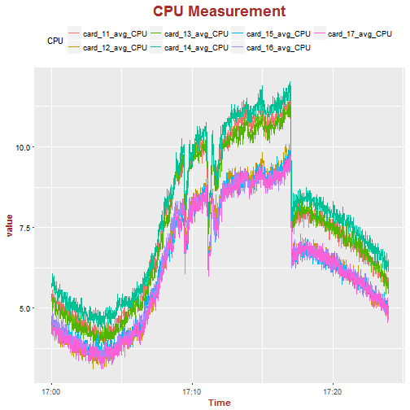
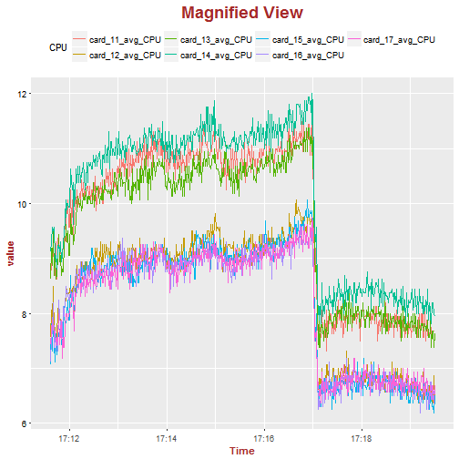

## Introduction

* This web app was developed using R Shiny package and hosted online on shinyapps.io.
* To get access to the web app, please visit the following: 
https://philipto.shinyapps.io/hw4_app/

--- .class #id 

## Features

* The web app allows the user to perform the following functions:

(1) Change the title of the chart; 

(2) Select which card to plot the CPU measurements; 

(3) Change the position of the legend; 

(4) Zoom into selected data points for better view.

(5) Computes the average CPU measurement for the selected data range.

---

## Charts With No Interactivities

This is an example of static chart.  It does not provide any interactivity.  The usefulness of such chart is very limited.

---

## Magnified View Possible On The Web App

* This is an example of a zoomed in chart after the user selected a subset of data points.

